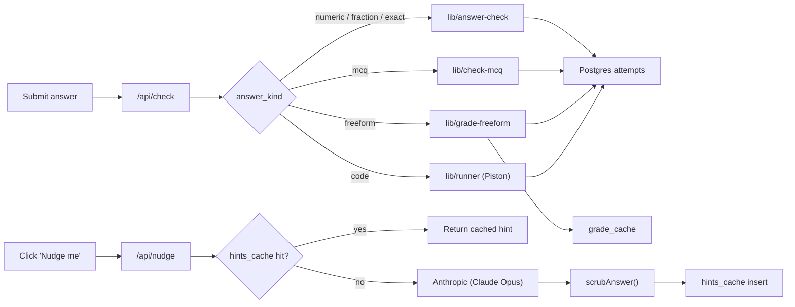

# QPrep

An agent-first quant interview prep platform. One unified, topic-tagged
question bank with hand-curated playlists, six answer kinds (numeric,
fraction, exact, MCQ, freeform, code), KaTeX-rendered LaTeX, and a 3-level
**Agentic Nudge Engine** that points at your specific reasoning gap without
revealing the answer.

## What's in the bank

Questions are tagged by **topic**. The current topic set is:

- Probability
- Statistics
- Pure Math
- Brainteasers
- Algorithms
- Data Structures
- Concurrency
- LLD (low-level design)
- System Design

Every question also carries a `target_roles: ('Trader' | 'Dev' | 'Researcher' | 'All')[]`
field so the sidebar can scope the bank to a role profile.

## Stack

- **Next.js 16** (App Router, TypeScript) with Tailwind for styling
- **KaTeX** (`react-katex`) for inline + block math
- **Supabase Postgres** for persistence (anonymous cookie sessions in v1)
- **Anthropic** (`claude-opus-4-7` by default) for the Nudge Engine
- **Groq / Anthropic / Ollama / keyword fallback** for freeform answer grading
- **Piston** (default `https://emkc.org/api/v2/piston`) for sandboxed code
  execution
- **Monaco** for the in-browser code editor

## Architecture



The nudge route enforces a daily per-cookie cap (30 hints/day by default,
tunable in `app/api/nudge/route.ts`) and caches every generated hint by
`(question_id, normalized_wrong_answer, level)` so equivalent mistakes
don't pay for a second model call. The freeform grader caches by
`(question_id, sha256(answer))` in `grade_cache`. The code runner is
treated as advisory: a failed Piston call returns a structured error
rather than silently marking the attempt wrong.

## Setup

1. **Install deps**

   ```bash
   npm install
   ```

2. **Create a Supabase project** at <https://supabase.com>, then copy
   `.env.local.example` to `.env.local`. Required keys:

   - `NEXT_PUBLIC_SUPABASE_URL`
   - `NEXT_PUBLIC_SUPABASE_ANON_KEY`
   - `SUPABASE_SERVICE_ROLE_KEY`
   - `ANTHROPIC_API_KEY` (and optional `ANTHROPIC_MODEL`)
   - `GROQ_API_KEY` (recommended; default freeform grader)
   - `CODE_RUNNER_URL` (default Piston public endpoint is fine)

   `GRADER_PROVIDER` selects the freeform grader (`groq` | `anthropic` |
   `ollama` | `keyword`). It defaults to `groq` when `GROQ_API_KEY` is set
   and falls back to `keyword` (offline) otherwise.

3. **Apply the migrations** in order, either via the Supabase SQL editor
   or `supabase db push`:

   - `supabase/migrations/0001_init.sql` — base schema (questions,
     attempts, hints, anon users)
   - `supabase/migrations/0002_unified_bank.sql` — unified topic-tagged
     bank, MCQ/freeform/code, playlists, `grade_cache`
   - `supabase/migrations/0003_roles_and_remove_finance.sql` — adds
     `target_roles`, removes the Finance topic and any legacy trader
     playlists

4. **Seed the question bank**

   ```bash
   npm run seed
   ```

   Upserts every question in `content/seed/<topic>.ts` and every playlist
   in `content/playlists.ts`. Idempotent: questions upsert on `slug`,
   playlists upsert on `slug`, `playlist_questions` are wiped and
   reinserted per playlist.

5. **Run the app**

   ```bash
   npm run dev
   ```

   Then open <http://localhost:3000>.

   If `.env.local` still has placeholder values, the app boots in **local
   preview mode**: questions come from the in-process seed bank,
   attempts/streaks/levels live in memory, the freeform grader uses the
   deterministic keyword fallback, and the code runner returns
   `skipped: true` for every test case so the UI still has something to
   render. The full nudge → check → grade → run loop works without any
   external service.

## Tests

```bash
npm test
```

Currently three Vitest suites:

- `lib/answer-check.test.ts` — numeric tolerance, fraction/decimal/percent
  equivalence, exact-string normalization, stable error signatures.
- `lib/check-mcq.test.ts` — MCQ option matching + error-signature
  stability.
- `lib/grade-freeform.test.ts` — provider selection, prompt construction,
  keyword fallback, and HTTP error handling for the freeform grader.

## Project layout

```
app/
  page.tsx                       # landing page (featured playlists + CTA)
  questions/page.tsx             # filterable unified question bank
  questions/[slug]/page.tsx      # one question (KaTeX + answer + nudges)
  playlists/page.tsx             # playlist index with progress bars
  playlists/[slug]/page.tsx      # one playlist
  api/check/route.ts             # validate + log + award (all 6 kinds)
  api/nudge/route.ts             # 3-level Claude hint with cache + rate limit
  api/run-code/route.ts          # Piston-backed code submission
components/
  Latex.tsx                      # mixed-content KaTeX renderer
  NudgePanel.tsx                 # 3-level escalating hint UI
  SiteHeader.tsx                 # nav + streak/points pill
  ThemeToggle.tsx                # light/dark/system toggle
  QuestionTable.tsx              # bank table
  FilterSidebar.tsx              # URL-driven filters (topic/role/diff/kind/company)
  answer/                        # one form per answer_kind
    AnswerSwitch.tsx
    NumericAnswerForm.tsx
    McqAnswerForm.tsx
    FreeformAnswerForm.tsx
    CodeAnswerForm.tsx
  ui/{button,input}.tsx
content/
  seed/                          # one file per topic (probability.ts, ...)
  seed/index.ts                  # bundles ALL_SEED_QUESTIONS
  playlists.ts                   # curated playlist definitions
  question-types.ts              # SeedQuestion union, Topic, TargetRole
lib/
  questions-data.ts              # server loaders + filter helpers
  local-dev.ts                   # in-memory bank + offline grader/runner
  answer-check.ts                # numeric/fraction/exact validator
  check-mcq.ts                   # MCQ validator
  grade-freeform.ts              # multi-provider AI grader
  runner.ts                      # Piston client + offline mock
  anthropic.ts                   # Claude client + scrubAnswer + nudge gen
  anon.ts                        # cookie-based identity helper
  supabase/{server,client}.ts
proxy.ts                         # Next.js 16 proxy: sets `qprep_anon` cookie
scripts/
  seed.ts                        # `npm run seed`
supabase/
  migrations/0001_init.sql
  migrations/0002_unified_bank.sql
  migrations/0003_roles_and_remove_finance.sql
```

## Roadmap

Phase 1 (in progress) — content + a daily drill mode:

- Expand the bank toward ~600 quality questions across Probability, Stats,
  Pure Math, Brainteasers, Concurrency, LLD, System Design, Algorithms,
  Data Structures.
- `/mental-math` — Zetamac-style client-generated drill mode (no seeded
  rows).

Phase 2 — retention + cost:

- Move the Nudge Engine to the same multi-provider shape as the freeform
  grader so Groq / Haiku / Ollama can serve nudges. Nudges on Opus get
  expensive fast.
- Question-of-the-day at `/today`.
- Spaced-repetition resurface ("you got these wrong 3 days ago, try
  again").
- Auto-advance to the next question after a correct submission.
- Per-topic mastery bars on the homepage (data already in
  `anon_users.topic_levels`).

Phase 3 — onboarding + social:

- 60-second diagnostic that picks a starter playlist for the user.
- Real auth via Supabase Auth (`anon_users.id` is already a UUID, so it's
  a rename, not a rewrite).
- Leaderboards, payments, sharing.

## Operational notes

- Anthropic model name lives in `ANTHROPIC_MODEL` (default
  `claude-opus-4-7`). Bump it when a newer Opus ships.
- Hint generations are cached forever; if the system prompt changes
  meaningfully, truncate `hints_cache` so users get the new style.
- Freeform grade decisions are cached forever in `grade_cache`. If you
  change the rubric on a question or upgrade the grader prompt, delete
  the rows for that `question_id` so existing answers are re-graded on
  next submission.
- The `bump_nudge_usage` SQL function and a per-cookie 30/day cap protect
  against API-cost surprises. Tune the constant in
  `app/api/nudge/route.ts`.
- The Piston public endpoint is rate-limited; for production you'll want
  to self-host (`docker run engineerbrian/piston`) and point
  `CODE_RUNNER_URL` at it.
